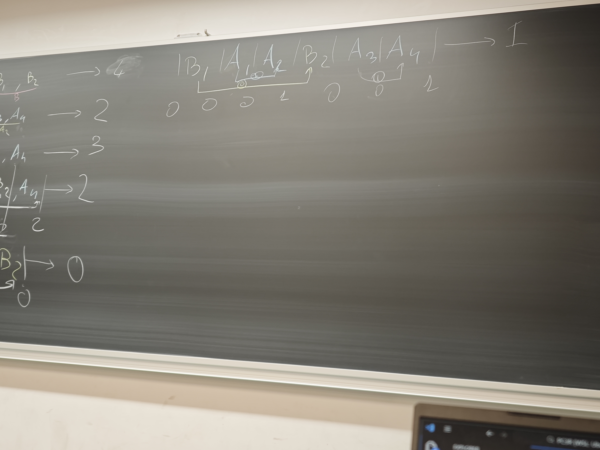
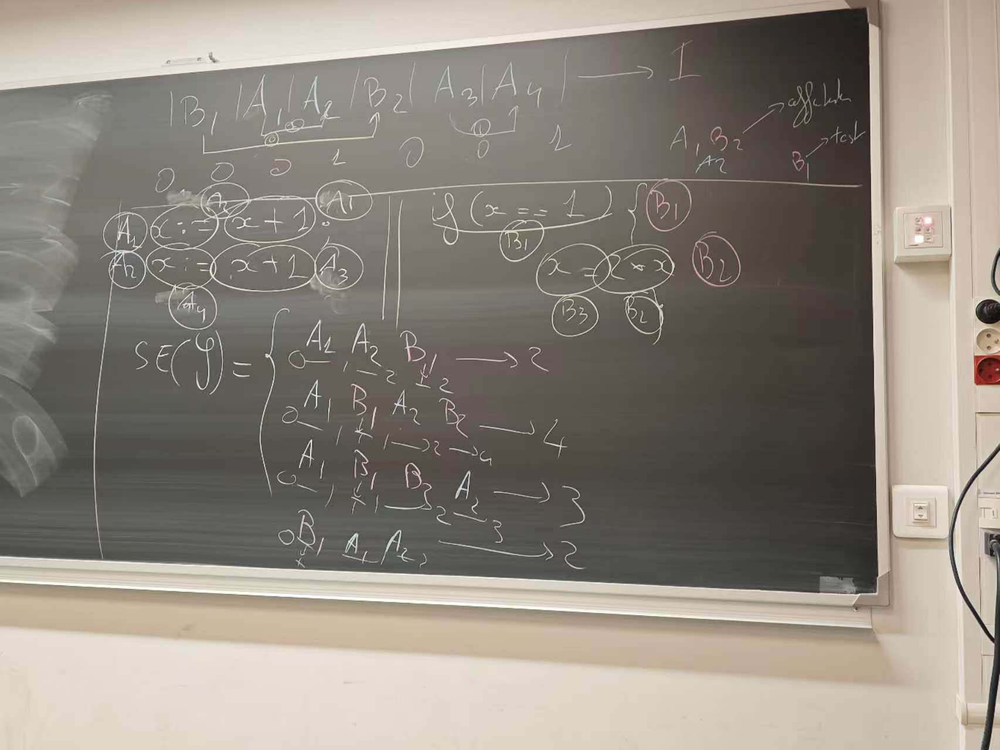
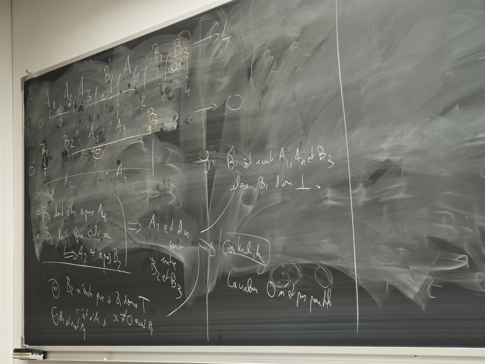
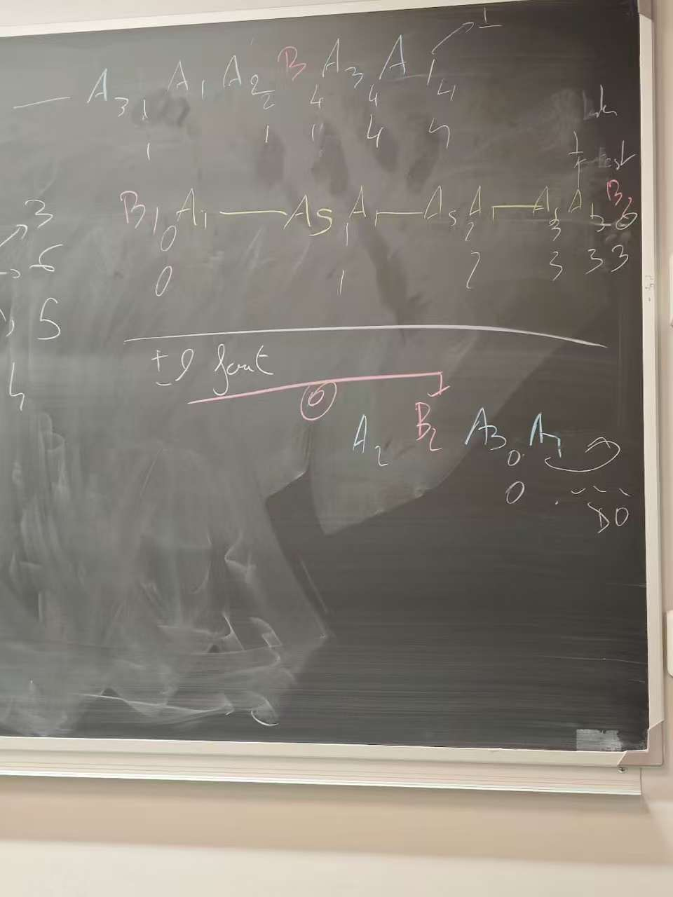
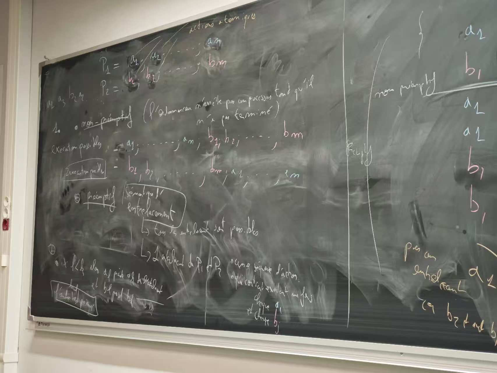
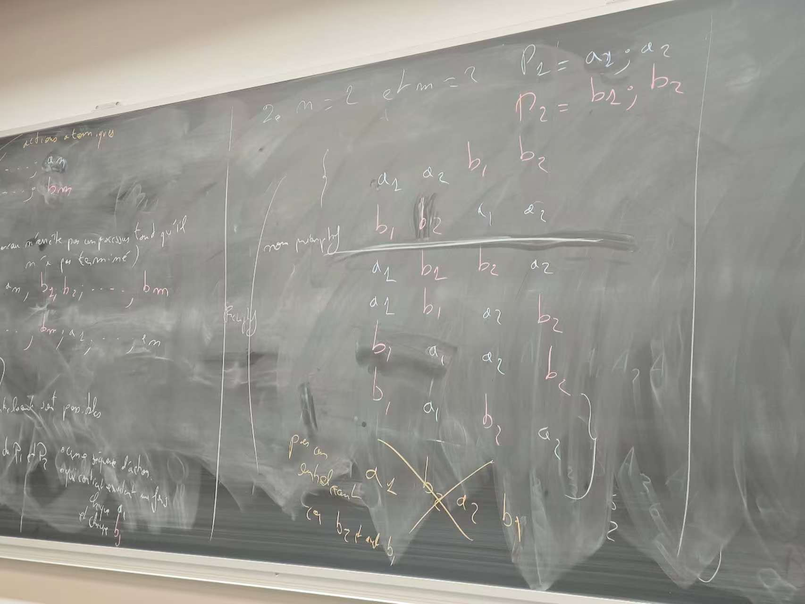
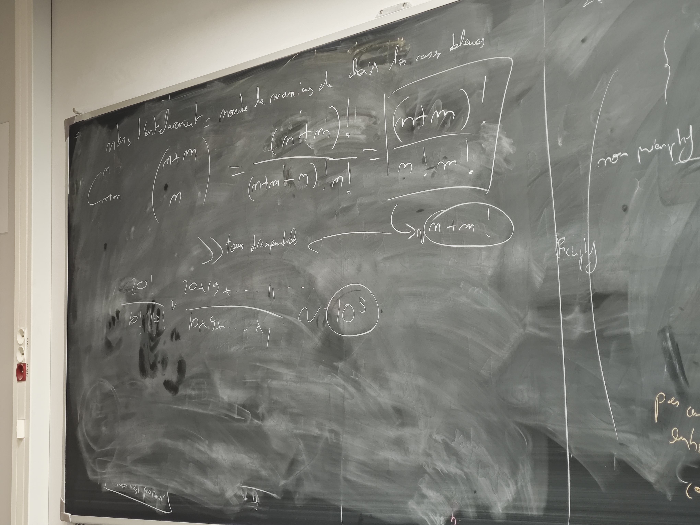

# question1:

### 1.1
se(y):{
    a1,a2,b; ->4
    b,a1,a2; ->2
    a1,b,a2; ->3
}=symentique d'entrelacement
a2一定在a1后面

如果单个操作non atomique
(b):如果赋值不是atomique,那么x+1一起,赋值不在一起.

他这个好奇怪啊,就是说我们只是单个表达式就直接过去了?然后也不是在同一个x上改?x不是共享的吗

解释为什么没有其他值:???
不是formel的,就是什么擦掉了值

### 1.1.2

值不可能是0:因为如果要为0,那么得是x = 2 *x在最后,所以a2和a4一定是在b2和b3中间,但是为了进判断条件,我们必须有x==1,然而为了得到x==1,我们要做相加的操作,所以矛盾.

写的是b3 doit etre apres a4,b2 doit lire 0 de x => a2 est apres b2

### 1.1.3
我好像看明白了,如果是单行原子,那么是正常的共享变量,但如果不是单行原子,那么寄存器存的东西还是原来之前的,然后中间的操作会被吞?那么比如说两个交叉吞了,那么会怎么样?a1,b1,a2,b2之类的

之后是为了获得y=0.

### 1.2 Combinatoire
1. non preemtif: l'ordonnanceur n'arrete pas un processus tant qu'il n'a pas termine

execution possible : 
反正就是local的顺序一定要遵守

2.  

3. 就是多少个里面选蓝色的可选,然后每个蓝色的都一样

